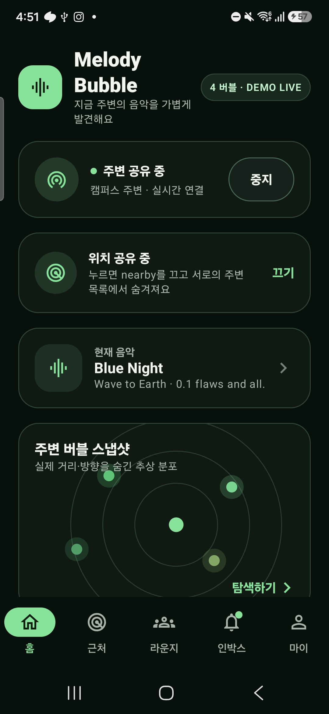
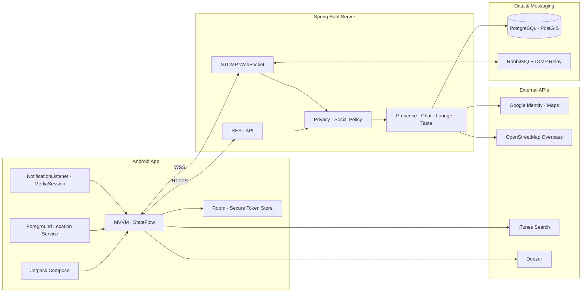

<p align="center">
  
</p>

<p align="center">
  주변 사람을 정확한 위치 대신 익명 음악 버블로 발견하고,<br />
  취향·리액션·라운지·대화로 연결되는 Android 근거리 음악 소셜 앱
</p>

<p align="center">
  
  
  
  
  
</p>

## Sync

**Sync**는 같은 공간에 있는 사람들의 음악 취향과 현재 재생곡을 익명으로 발견하는 서비스입니다. 사용자는 주변 공유를 직접 시작하고, 취향이 맞는 상대에게 음악 리액션을 보내거나 팔로우할 수 있습니다. 맞팔 이후에는 1:1 채팅으로 대화를 이어가고, 위치 기반 음악 라운지에서는 추천곡과 실시간 투표를 함께 즐길 수 있습니다.

정확한 좌표·거리·방향·이동 경로는 다른 사용자에게 공개하지 않습니다. 서버는 공개 범위와 차단 관계를 반영한 가공 데이터만 개인 Queue로 전달하며, 화면의 버블 위치는 실제 방향이 아닌 시각적 배치입니다.

<p align="center">
  
</p>

## 주요 기능

| 기능 | 설명 |
| --- | --- |
| Google 로그인·온보딩 | Google 계정으로 로그인하고 멜로디 별칭, 선호 장르·아티스트·대표곡을 설정합니다. |
| 주변 공유 | 사용자가 직접 Foreground Service를 시작·종료하고 위치, Presence, 현재 음악을 동기화합니다. |
| 익명 버블맵 | 주변 사용자를 익명 handle, 음악 상태, 취향 유사도와 넓은 근접 구간으로 표현합니다. |
| 음악 탐색 | 현재 재생곡 자동 감지, iTunes 곡 검색, Deezer 아티스트 이미지, 미리듣기와 수동 선택을 지원합니다. |
| 음악 리액션·팔로우 | 맞팔 전에는 정해진 리액션만 보내고, 팔로우·맞팔 이후 채팅으로 연결합니다. |
| 실시간 채팅 | REST로 대화 내역을 조회하고 STOMP 개인 Queue로 메시지와 읽음 상태를 갱신합니다. |
| 위치 기반 라운지 | 지도에서 실제 건물 라운지를 찾고 하위 라운지를 생성하거나 참여합니다. |
| 추천곡·투표 | 라운지에 곡 카드를 공유하고 리액션과 장르·분위기 투표를 실시간 반영합니다. |
| 공개 음악 프로필 | 대표곡, 선호 장르·아티스트, 청취 인사이트와 공통 취향을 공개 범위에 따라 표시합니다. |
| 안전·개인정보 | 발견 가능 여부, 프로필 공개 범위, 차단·신고, rate limit과 위치 TTL을 적용합니다. |

## 개인정보 설계

- 다른 사용자에게 GPS 좌표, 정확한 거리, 실제 방향, 이동 경로를 전달하지 않습니다.
- 주변 결과는 수신자별 공개 범위와 차단 관계를 적용해 개인 Queue로 전송합니다.
- 위치는 현재 공유 세션에만 사용하고 TTL 만료 또는 공유 종료 후 주변 검색에서 제외합니다.
- Android Room에는 원시 좌표, 위치 이력, 주변 사용자 목록이나 JWT를 저장하지 않습니다.
- 맞팔 전 자유 텍스트를 제한하고 정해진 음악 리액션만 허용합니다.
- 사용자가 공유를 직접 시작한 경우에만 Foreground Service가 동작합니다.

자세한 기준은 [데이터 저장 및 개인정보 정책](docs/DATA_POLICY.md)에서 확인할 수 있습니다.

## 시스템 아키텍처



초기 조회, 인증, 설정 변경과 과거 기록은 REST가 담당합니다. 주변 사용자 변화, 개인 알림, 채팅과 라운지 이벤트처럼 즉시 반영되어야 하는 데이터는 STOMP over WebSocket으로 전달합니다. 서버는 Flyway migration으로 PostgreSQL/PostGIS 스키마를 관리합니다.

## 기술 스택

| 영역 | 기술 |
| --- | --- |
| Android | Kotlin, Jetpack Compose, Material 3, Navigation Compose |
| Architecture | MVVM, ViewModel, Coroutines, StateFlow |
| Network | Retrofit, OkHttp, Gson, STOMP over WebSocket |
| Device | Fused Location Provider, Google Maps SDK, BLE, Nearby Connections |
| Local | Room, Secure Token Store |
| Backend | Kotlin, Spring Boot 3, Spring Security, JDBC, JWT |
| Data | PostgreSQL, PostGIS, Flyway |
| Realtime | Spring WebSocket, STOMP, RabbitMQ Broker Relay |
| Infra | Docker, AWS ECS Express, ECR, GitHub Actions |
| Test | JUnit, Spring Boot Test, Compose UI Test, Espresso |

## 프로젝트 구조

```text
.
├── app/                         # Android 앱
│   └── src/main/java/.../
│       ├── core/model/          # UI·도메인 모델과 reducer
│       ├── data/                # Repository, Room, REST, 실시간 통신
│       ├── nearby/              # BLE·근접 측정
│       ├── service/             # 위치 공유·현재 음악 서비스
│       └── ui/                  # Compose 화면, ViewModel, Navigation
├── server/                      # Spring Boot 서버
│   └── src/main/kotlin/.../
│       ├── auth/                # Google 로그인·JWT
│       ├── nearby/              # Presence·주변 탐색·리액션
│       ├── lounge/              # 건물·하위 음악 라운지
│       ├── chat/                # 1:1 채팅
│       ├── profile/             # 공개 음악 프로필
│       ├── social/              # 팔로우·차단·신고
│       └── realtime/            # STOMP 이벤트 발행
├── ml/taste_match/              # 취향 임베딩 학습·평가 도구
├── docs/                        # API, 개인정보, 구현 기준 문서
└── .github/workflows/           # Android·서버 CI와 AWS 배포
```

## 실행 환경

- Android Studio 최신 안정 버전
- JDK 21
- Android SDK: `minSdk 24`, `targetSdk 35`, `compileSdk 36`
- Docker Desktop 또는 PostgreSQL 16 + PostGIS 3.5
- 세로형 Android 스마트폰 또는 에뮬레이터

## Android 앱 실행

1. 저장소를 clone하고 Android Studio에서 루트 프로젝트를 엽니다.
2. Gradle Sync를 실행해 SDK 경로가 포함된 `local.properties`를 생성합니다.
3. `local.properties.example`을 참고해 앱 설정을 추가합니다.

```properties
# 로컬 서버를 사용할 때
API_BASE_URL=http://10.0.2.2:8080
STOMP_WS_URL=ws://10.0.2.2:8080/ws

# Google Cloud Console의 웹 애플리케이션 OAuth Client ID
GOOGLE_WEB_CLIENT_ID=your-client-id.apps.googleusercontent.com

# 건물 라운지 지도를 사용할 때
GOOGLE_MAPS_API_KEY=your-google-maps-key
```

4. Android Studio에서 `app` 구성을 실행하거나 다음 명령으로 APK를 빌드합니다.

```bash
./gradlew assembleDebug
```

로컬 Android 에뮬레이터에서 호스트 서버는 `10.0.2.2`로 접근합니다. Release 빌드는 HTTPS/WSS URL만 허용합니다. 실제 토큰과 API 키가 포함된 `local.properties`는 커밋하지 마세요.

## 서버 실행

로컬 인프라는 Docker Compose로 PostgreSQL/PostGIS와 RabbitMQ를 실행합니다.

```bash
cd server

export POSTGRES_PASSWORD=local-postgres-password
export RABBITMQ_PASSWORD=local-rabbitmq-password
docker compose up -d

export JWT_SECRET='replace-with-at-least-32-bytes-secret'
export GOOGLE_WEB_CLIENT_ID='your-client-id.apps.googleusercontent.com'
../gradlew bootRun
```

PowerShell에서는 `export NAME=value` 대신 `$env:NAME='value'`를 사용합니다. 서버 기본 주소는 `http://localhost:8080`, WebSocket endpoint는 `ws://localhost:8080/ws`입니다.

| 환경 변수 | 용도 | 기본값 |
| --- | --- | --- |
| `DATABASE_URL` | PostgreSQL JDBC URL | `jdbc:postgresql://localhost:5432/melody_bubble` |
| `POSTGRES_USER` | DB 사용자 | `melody` |
| `POSTGRES_PASSWORD` | DB 비밀번호 | 필수 |
| `JWT_SECRET` | JWT 서명 키(32바이트 이상) | 필수 |
| `GOOGLE_WEB_CLIENT_ID` | Google ID Token audience | 개발용 ID |
| `WEBSOCKET_BROKER_RELAY_ENABLED` | RabbitMQ broker relay 사용 여부 | `false` |
| `DEMO_SEED_ENABLED` | 로컬 데모 계정·데이터 생성 여부 | `false` |

서버 실행과 운영 DB 접근에 관한 자세한 내용은 [서버 README](server/README.md)를 참고하세요.

## 테스트

```bash
# Android unit test, lint, APK
./gradlew testDebugUnitTest lintDebug assembleDebug

# 연결된 에뮬레이터·기기가 있을 때 Android UI test
./gradlew connectedDebugAndroidTest

# Spring Boot server test
./gradlew -p server test
```

`test` 브랜치 push 시 GitHub Actions가 Android 테스트·lint·APK 빌드와 서버 테스트를 수행한 뒤 AWS ECS Express 배포를 진행합니다.

## 상세 문서

- [MVP 구현 기준](docs/MVP_GUIDE.md)
- [REST·STOMP API 계약](docs/API_CONTRACT.md)
- [데이터 저장 및 개인정보 정책](docs/DATA_POLICY.md)
- [위치 기반 라운지 구현](docs/LOCATION_LOUNGE_REIMPLEMENTATION.md)
- [프로필 구현 계획](docs/PROFILE_IMPLEMENTATION_PLAN.md)
- [Information Architecture](Information%20architecture.png)
- [Wireframe](wireframe.png)
- [Database Diagram](DB.png)
- [서비스 기획안](%EA%B8%B0%ED%9A%8D%EC%84%9C%20%EC%B4%88%EC%95%88.md)

## 팀

| 이름 | 소속 |
| --- | --- |
| 박수현 | Hanyang University 22 |
| 이지오 | KAIST 24 |
