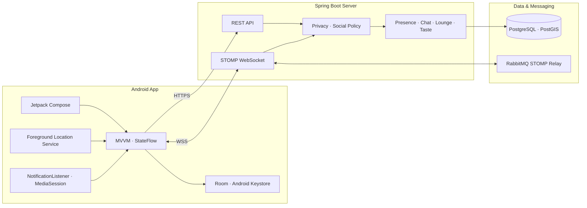

# 26s-w2-c3-01

## 공통과제 II : 협업형 실전 산출물 제작 (2인 1팀)

**목적:** 실시간 인터랙션, LLM Wrapper, Cross-Platform 중 하나의 옵션을 선택해 구현하며, 선택한 기술을 실제로 동작하는 형태의 산출물로 완성한다.

**선택 옵션:**

| 옵션 | 설명 |
|---|---|
| 실시간 인터랙션 | 사용자 간 상태 변화, 실시간 데이터 흐름, 스트리밍 응답 등 실시간성이 드러나는 기능을 구현 |
| LLM Wrapper | LLM API를 활용하여 AI 기능이 포함된 산출물을 구현 |
| Cross-Platform | 하나의 산출물을 여러 실행 환경에서 사용할 수 있도록 구현 |

**결과물:** 선택한 옵션이 적용된 작동 가능한 산출물, 실행 가능한 코드, 시연 자료 및 관련 문서

---

## 팀원

| 이름 | 학교 | GitHub | 역할 |
|---|---|---|---|
| 박지호 | UNIST 21 | [batiger00](https://github.com/batiger00) | Android, Backend, 위치·근접 탐색 |
| 이지오 | KAIST 24 | [easy0131](https://github.com/easy0131) | Android, Backend, 음악·소셜 기능 |

---

## 선택 옵션

- [x] 실시간 인터랙션
- [ ] LLM Wrapper
- [ ] Cross-Platform

Sync는 **STOMP over WebSocket**을 중심으로 주변 사용자 상태, 음악 리액션, 1:1 채팅, 음악 라운지와 실시간 투표를 동기화한다. 사용자별 이벤트는 개인 Queue로, 여러 사용자가 함께 보는 라운지 이벤트는 Topic으로 전달한다.

---

## 기획안

- **산출물 주제:** Android 기반 근거리 음악 소셜 네트워크 서비스 **Sync**
- **제작 목적:** 같은 공간에 있는 사람을 정확한 위치나 얼굴 대신 익명 음악 버블로 발견하고, 현재 음악과 취향을 매개로 안전하게 연결한다.
- **선택 옵션:** 실시간 인터랙션
- **핵심 구현 요소:**
  - Foreground Service와 Presence heartbeat를 이용한 사용자 주도 주변 공유
  - STOMP 개인 Queue 기반 주변 사용자·리액션·채팅 실시간 갱신
  - 위치 기반 음악 라운지 Topic과 추천곡·리액션·투표 동기화
  - 공개 범위·차단 관계·위치 TTL을 적용한 개인정보 보호
- **사용 / 시연 시나리오:**
  1. Google 계정으로 로그인하고 음악 취향 프로필을 설정한다.
  2. 주변 공유를 시작해 근처의 익명 음악 버블을 확인한다.
  3. 취향 유사도가 높은 사용자의 공개 음악 프로필을 열어 리액션과 팔로우를 보낸다.
  4. 맞팔 사용자와 1:1 실시간 채팅을 시작한다.
  5. 실제 건물 기반 음악 라운지에 입장해 추천곡을 공유하고 투표에 참여한다.
- **팀원별 역할:** Android와 Spring Boot 서버를 함께 개발하고, 기능 단위로 앱·API·실시간 계약·테스트를 나누어 구현했다.

### 개발 일정

| 날짜 | 목표 |
|---|---|
| Day 1 | 서비스 기획, Information Architecture, Wireframe, DB 설계 |
| Day 2 | Android 프로젝트 구성, Compose 공통 UI, 인증·온보딩 |
| Day 3 | 주변 공유, 익명 버블맵, 위치·Presence 서버 구현 |
| Day 4 | 음악 검색·자동 감지, 취향 프로필과 유사도 구현 |
| Day 5 | 팔로우·리액션·공개 프로필·1:1 채팅 구현 |
| Day 6 | 건물·하위 음악 라운지, 추천곡 카드와 실시간 투표 구현 |
| Day 7 | 개인정보 정책 보완, 통합 테스트, AWS 배포와 문서화 |

---

## 구현 명세서

| 구현 요소 | 설명 | 우선순위 |
|---|---|---|
| Google 로그인·온보딩 | Google ID Token 검증과 JWT 발급, 음악 취향 프로필 생성 | 필수 |
| 주변 공유·Presence | Foreground Service, 위치 업데이트, heartbeat와 TTL 관리 | 필수 |
| 익명 음악 버블맵 | 가공된 배치, 근접 구간, 취향 유사도로 주변 사용자 표현 | 필수 |
| 현재 음악·검색 | NotificationListener·MediaSession 감지, iTunes 검색과 미리듣기 | 필수 |
| 음악 리액션·팔로우 | 정해진 리액션, 팔로우·맞팔, 공개 프로필 | 필수 |
| 1:1 채팅 | REST 내역 조회와 STOMP 개인 Queue 실시간 메시지 | 필수 |
| 위치 기반 음악 라운지 | OSM 건물 탐색, 하위 라운지 생성·입장·퇴장 | 필수 |
| 추천곡·실시간 투표 | 라운지 곡 카드, 리액션, 장르·분위기 투표 | 필수 |
| BLE 근접 보정 | GPS/PostGIS 탐색을 보조하는 근거리 beacon·측정 | 선택 |
| 취향 임베딩 | 청취 데이터 기반 유사도 모델 학습·평가 및 shadow 적용 | 선택 |

---

## 아키텍처



- 인증, 초기 화면 조회, 설정 변경과 과거 기록 조회는 REST API가 담당한다.
- 주변 사용자 변화, 개인 알림, 채팅과 라운지 이벤트는 STOMP over WebSocket으로 전달한다.
- 수신자별 주변 정보는 공개 Topic에 방송하지 않고 공개 범위와 차단 관계를 적용한 뒤 개인 Queue로 전달한다.
- 위치 데이터에는 TTL을 적용하며, 공유 종료 후 주변 검색 대상에서 제거한다.

---

## 설계 문서

### 화면 / 인터페이스 설계

<!-- 스크린샷 추가 예정 -->

#### 1. 로그인·음악 온보딩

<!-- 스크린샷 -->

#### 2. 홈·주변 음악 버블맵

<!-- 스크린샷 -->

#### 3. 사용자 상세·공개 음악 프로필

<!-- 스크린샷 -->

#### 4. 건물 지도·음악 라운지

<!-- 스크린샷 -->

#### 5. 인박스·1:1 채팅

<!-- 스크린샷 -->

#### 6. 마이페이지·설정

<!-- 스크린샷 -->

### 데이터 구조

| 영역 | 주요 데이터 | 역할 |
|---|---|---|
| 인증 | users, user_identities, refresh_tokens | Google Identity 연결과 JWT 재발급 관리 |
| 프로필 | user_profiles, taste_profiles, representative_tracks | 멜로디 별칭, 공개 프로필, 음악 취향 관리 |
| Presence | presence_sessions, current_locations, music_statuses | 공유 세션, TTL 기반 최신 위치와 음악 상태 관리 |
| 주변 탐색 | nearby_beacons, direct_proximity_measurements | 익명 handle과 BLE·위치 기반 근접 구간 관리 |
| 소셜 | follows, blocks, reports, music_reactions | 팔로우·맞팔, 차단·신고, 음악 리액션 관리 |
| 채팅 | chat_rooms, chat_messages | 맞팔 사용자 간 1:1 대화와 읽음 상태 관리 |
| 라운지 | location_lounges, sub_lounges, members, cards, votes | 실제 공간 기반 라운지와 추천곡·투표 관리 |
| 로컬 저장 | Room, SharedPreferences, Android Keystore | 비민감 UI 상태와 암호화된 인증 토큰 저장 |

Android Room에는 원시 좌표, 이동 경로, 주변 사용자 목록이나 JWT를 저장하지 않는다. 서버의 위치 데이터는 현재 공유 세션에만 사용하고 TTL 만료 시 검색 대상에서 제외한다.

### API / 외부 서비스 연동

| Method / 방식 | Endpoint / 서비스 | 설명 | 요청 | 응답 | 비고 |
|---|---|---|---|---|---|
| REST | `/api/v1/auth/google` | Google 로그인·회원가입 | Google ID Token | JWT Access/Refresh Token | Google Identity |
| REST | `/api/v1/nearby/snapshot` | 주변 사용자 초기 조회 | 인증·공유 세션 | 가공된 주변 사용자 목록 | 정확 좌표 미제공 |
| STOMP SEND | `/app/presence/*` | Presence 시작·heartbeat·종료 | session ID, timestamp | ACK·주변 Delta | 개인 Queue |
| STOMP Queue | `/user/queue/nearby` | 주변 사용자·인기곡 갱신 | - | 실시간 event envelope | 수신자별 정책 적용 |
| REST / STOMP | `/api/v1/chat/**`, `/user/queue/chat` | 대화방·메시지 조회 및 실시간 갱신 | room ID, message | message·read state | 맞팔 권한 확인 |
| REST / STOMP | `/api/v1/location-lounges/**`, `/topic/sub-lounges/{id}` | 라운지 입장·추천곡·리액션·투표 | lounge ID, track, vote | lounge snapshot·event | 참여 권한 확인 |
| External API | Google Maps · Fused Location | 지도 표시와 현재 위치 획득 | 위치 권한 | 지도·기기 위치 | 원시 좌표 외부 노출 금지 |
| External API | OpenStreetMap Overpass | 주변 실제 건물 조회 | 위치 주변 query | OSM 건물 정보 | 서버 24시간 캐시 |
| External API | iTunes Search | 곡·아티스트·앨범 이미지·미리듣기 검색 | 검색어 | track metadata | HTTPS 결과만 사용 |
| External API | Deezer Artist Search | 아티스트 이미지 보강 | 아티스트명 | artist image | iTunes 이미지 fallback |

상세 계약은 [API·실시간 계약](docs/API_CONTRACT.md)에서 확인할 수 있다.

---

## 산출물 및 실행 방법

- **산출물 설명:** 근거리 음악 탐색, 소셜 연결, 채팅과 음악 라운지를 제공하는 Android 앱과 Spring Boot 실시간 서버
- **실행 환경:** Android Studio, JDK 21, Android API 24+, Docker Desktop
- **실행 방법:** Android 앱과 Spring Boot 서버를 각각 실행하고 REST·STOMP endpoint를 `local.properties`에 설정한다.
- **시연 영상 / 이미지:** 추가 예정

### Android 실행 방법

```properties
# local.properties
API_BASE_URL=http://10.0.2.2:8080
STOMP_WS_URL=ws://10.0.2.2:8080/ws
GOOGLE_WEB_CLIENT_ID=your-client-id.apps.googleusercontent.com
GOOGLE_MAPS_API_KEY=your-google-maps-key
```

```bash
./gradlew assembleDebug
```

Android Studio에서 `app` 구성을 실행하거나 생성된 debug APK를 에뮬레이터·기기에 설치한다. Android 에뮬레이터에서는 호스트 서버를 `10.0.2.2`로 접근한다.

### 서버 실행 방법

```bash
cd server

export POSTGRES_PASSWORD=local-postgres-password
export RABBITMQ_PASSWORD=local-rabbitmq-password
docker compose up -d

export JWT_SECRET='replace-with-at-least-32-bytes-secret'
export GOOGLE_WEB_CLIENT_ID='your-client-id.apps.googleusercontent.com'
../gradlew bootRun
```

PowerShell에서는 `export NAME=value` 대신 `$env:NAME='value'`를 사용한다. 서버 기본 주소는 `http://localhost:8080`, WebSocket endpoint는 `ws://localhost:8080/ws`이다.

### 검증

```bash
# Android unit test, lint, APK
./gradlew testDebugUnitTest lintDebug assembleDebug

# 연결된 에뮬레이터·기기가 있을 때 UI test
./gradlew connectedDebugAndroidTest

# Spring Boot server test
./gradlew -p server test
```

### 기술 구성

| 분류 | 사용 기술 |
|---|---|
| 핵심 기술 | STOMP over WebSocket, 개인 Queue, 라운지 Topic, Foreground Service |
| Android | Kotlin, Jetpack Compose, Material 3, MVVM, Coroutines, StateFlow |
| 네트워크 | Retrofit, OkHttp, Gson |
| 위치·근접 | Fused Location Provider, Google Maps SDK, BLE, Nearby Connections |
| 음악 | NotificationListenerService, MediaSession, iTunes Search, Deezer |
| Backend | Kotlin, Spring Boot 3, Spring Security, Spring WebSocket, JDBC, JWT |
| 데이터 저장 | PostgreSQL, PostGIS, Flyway, Android Room |
| 메시지 브로커 | RabbitMQ, STOMP Broker Relay |
| 배포 | Docker, AWS ECS Express, ECR, GitHub Actions |

---

## 회고 문서

### Keep — 잘 된 점, 다음에도 유지할 것

- Android와 서버 사이의 REST·STOMP 계약을 문서로 먼저 정의하고 함께 갱신한 점
- 정확한 좌표·거리·방향을 노출하지 않는 개인정보 원칙을 구현 전반에 일관되게 적용한 점
- 핵심 시연 흐름을 자동 테스트와 실제 기기 테스트로 반복 검증한 점

### Problem — 아쉬웠던 점, 개선이 필요한 것

- 위치·알림·MediaSession처럼 실제 기기와 앱별 차이가 큰 기능의 테스트 비용이 높았음
- 실시간 상태와 REST snapshot 사이의 정합성을 맞추는 과정에서 복구 로직이 복잡해짐
- 짧은 개발 기간에 Android, 서버, DB, 배포를 함께 다루면서 문서 최신화를 유지하기 어려웠음

### Try — 다음번에 시도해볼 것

- 다양한 Android 제조사·음악 앱 조합을 대상으로 한 기기 테스트 자동화
- STOMP 연결 장애와 순서 역전을 재현하는 통합 테스트 및 부하 테스트 확대
- 취향 임베딩 shadow 결과를 충분히 평가한 뒤 실제 추천·유사도 계산에 단계적으로 적용

### 팀원별 소감

**박지호:**

> 작성 예정

**이지오:**

> 작성 예정

---

## 참고 자료

- [프로젝트 Notion — Sync](https://app.notion.com/p/Sync-39e5ffe9590080aa9784da3fa8a3f33d)
- [MVP 구현 기준](docs/MVP_GUIDE.md)
- [API·실시간 계약](docs/API_CONTRACT.md)
- [데이터 저장 및 개인정보 기준](docs/DATA_POLICY.md)
- [위치 기반 라운지 구현 문서](docs/LOCATION_LOUNGE_REIMPLEMENTATION.md)
- [Information Architecture](Information%20architecture.png)
- [Wireframe](wireframe.png)
- [Database Diagram](DB.png)
- [WebSocket API — MDN](https://developer.mozilla.org/en-US/docs/Web/API/WebSockets_API)
- [STOMP Specification](https://stomp.github.io/stomp-specification-1.2.html)
